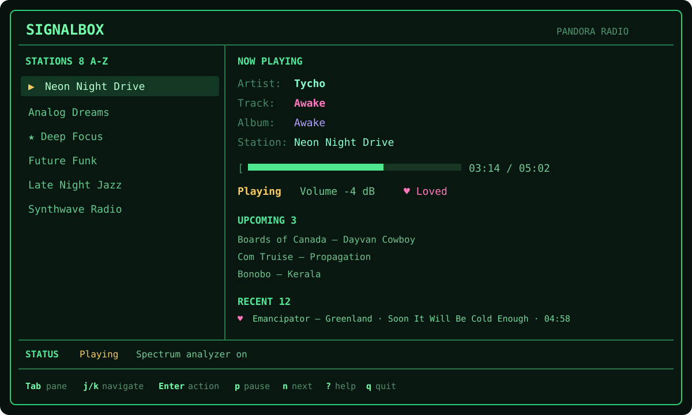
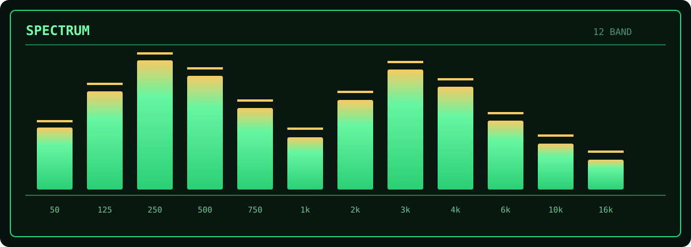

Signalbox
=========

|CI| |License| |Platforms|

**Pandora radio, tuned for the terminal.**

Signalbox is a modern, open-source terminal client for Pandora: a responsive
phosphor TUI, real-time audio spectrum, fast keyboard navigation, and the full
station-management foundation inherited from pianobar.

         upcoming tracks, and listening history
   :align: center

.. |CI| image:: https://github.com/simplycole/signalbox/actions/workflows/build.yml/badge.svg?branch=develop
   :target: https://github.com/simplycole/signalbox/actions/workflows/build.yml
   :alt: Build status
.. |License| image:: https://img.shields.io/badge/license-MIT-39ff88.svg
   :target: COPYING
   :alt: MIT License
.. |Platforms| image:: https://img.shields.io/badge/platform-macOS%20%7C%20Linux-58d6ff.svg
   :alt: macOS and Linux

Why Signalbox?
--------------

Signalbox keeps pianobar's lean native-C core and proven Pandora integration,
then builds a more discoverable terminal experience around it. It is currently
an early-stage project: the TUI is the default on supported interactive
terminals, while classic pianobar-compatible mode remains available for
compatibility and headless use.

Highlights
----------

- Responsive ``ncursesw`` interface with phosphor, amber, neutral, and
  monochrome themes
- Real PCM-driven 8/12-band spectrum analyzer with smoothing and peak hold
- Station filtering, A-Z/original/favorites-first sorting, local favorites,
  and numeric jump
- Now-playing metadata, adaptive progress, signed-dB volume, upcoming queue,
  and full in-memory session history
- Native TUI flows for station creation, rename/delete, QuickMix, genres,
  seeds, feedback, bookmarks, and station modes
- Configurable bindings with an in-app, responsive, scrollable HELP overlay
- Secure saved credentials through macOS Keychain or Linux Secret Service;
  plaintext is never written by the TUI
- Classic UI, FIFO remote control, audio pipe, proxy, and event-command
  compatibility inherited from pianobar

Controls
--------

Press ``?`` in the TUI for the authoritative list: configured action bindings
are reflected there automatically.

.. list-table:: Default TUI controls
   :header-rows: 1
   :widths: 28 72

   * - Key
     - Action
   * - ``↑``/``↓``, ``j``/``k``
     - Move through the focused list
   * - ``PgUp``/``PgDn``
     - Move by a page
   * - ``Home``/``End``
     - Jump to first/last item
   * - ``Enter``
     - Tune station or open actions
   * - ``Tab``/``Shift+Tab``
     - Switch between Stations and Recent
   * - ``/`` / ``#``
     - Filter stations / jump to a visible station number
   * - ``f`` / ``z``
     - Toggle favorite / cycle station sort
   * - ``p`` / ``n``
     - Pause or resume / next track
   * - ``+`` / ``-``
     - Love / ban
   * - ``(`` / ``)`` / ``^``
     - Volume down / up / reset to 0 dB
   * - ``h`` / ``u``
     - Session history / upcoming tracks
   * - ``V``
     - Toggle the spectrum analyzer
   * - ``?`` / ``q``
     - HELP / quit

The inherited action keys can be remapped in the config. ``V`` is available
for the visualizer only when it does not conflict with a configured action;
lowercase ``v`` retains its pianobar action.

Build and run
-------------

Signalbox currently targets macOS and Linux. You need a C99 compiler,
``pkg-config``, FFmpeg (``libavcodec``, ``libavformat``, ``libavutil``, and
``libavfilter``), libcurl, libgcrypt, json-c, libao, pthreads, and ``ncursesw``.

macOS (Homebrew)
~~~~~~~~~~~~~~~~

.. code-block:: console

   brew install ffmpeg json-c libao libgcrypt ncurses pkgconf make
   gmake

Debian / Ubuntu
~~~~~~~~~~~~~~~

.. code-block:: console

   sudo apt-get install build-essential libao-dev libavcodec-dev \
     libavfilter-dev libavformat-dev libavutil-dev libcurl4-gnutls-dev \
     libgcrypt20-dev libjson-c-dev libncursesw5-dev libsecret-1-dev pkg-config
   make

Launch Signalbox (the full-screen TUI is selected automatically in a supported
interactive terminal):

.. code-block:: console

   ./signalbox

Useful options:

.. code-block:: console

   ./signalbox --theme phosphor
   ./signalbox --visualizer off
   ./signalbox --tui
   ./signalbox --classic
   ./signalbox --forget-credentials

Install under ``/usr/local`` with ``sudo make install`` (or ``gmake install``
on macOS). Override ``PREFIX`` or use ``DESTDIR`` for packaging. See the
`annotated configuration`_ for settings and key remapping.

.. _annotated configuration: contrib/config-example

Configuration and credentials
-----------------------------

Signalbox reads ``$XDG_CONFIG_HOME/signalbox/config`` (normally
``~/.config/signalbox/config``). If it is absent, the legacy
``$XDG_CONFIG_HOME/pianobar/config`` is used as a compatibility fallback; files
are never merged or migrated automatically.

In TUI mode, passwords can be stored in macOS Keychain or a Linux Secret
Service provider such as GNOME Keyring/KWallet. Linux support is compiled when
``libsecret-1`` is available and fails closed when the service cannot be
reached. Only the selected account email is written to Signalbox's
mode-``0600`` account file. Explicit ``password`` and ``password_command``
settings remain supported for compatibility.

pianobar lineage
----------------

Signalbox is a continuation of `pianobar`_, created by Lars-Dominik Braun. Its
working Pandora protocol/player implementation, MIT license, attribution, and
complete Git history are intentionally preserved. The ``upstream`` remote
tracks the canonical project, and ``upstream-baseline-2026-09-01`` records the
verified starting point for Signalbox development.

Signalbox is independent and is not affiliated with or endorsed by Pandora.
Pandora is a third-party service and trademark.

.. _pianobar: https://github.com/PromyLOPh/pianobar

Roadmap
-------

Near-term work is deliberately platform-first:

1. Linux Secret Service runtime validation across selected desktops
2. Windows portability boundaries and a Credential Manager backend
3. Continue classic/FIFO/headless compatibility validation with the TUI as the
   interactive default
4. Persistent listening history with explicit retention and privacy behavior
5. Richer visualizer modes and optional terminal artwork
6. Homebrew/Linux packaging and reproducible releases

Native Windows is a roadmap target, not a currently supported build. The plan
is a native ``.exe`` with a Windows terminal/audio adaptation and
``CredRead``/``CredWrite``/``CredDelete`` behind the existing credential
interface. See the detailed `roadmap`_, `TUI design`_, `architecture`_,
`upstream record`_, and `QA checklist`_.

.. _roadmap: docs/ROADMAP.md
.. _TUI design: docs/TUI.md
.. _architecture: docs/ARCHITECTURE.md
.. _upstream record: docs/UPSTREAM.md
.. _QA checklist: docs/QA.md

Contributing
------------

Focused bug reports, platform build results, documentation corrections, and
narrow patches are welcome. Include platform and dependency versions with test
results, preserve upstream attribution, and keep unrelated behavior changes in
separate commits.

License
-------

Signalbox and its inherited pianobar sources are distributed under the
`MIT License`_. Copyright notices for Lars-Dominik Braun and other contributors
remain in the source and history.

.. _MIT License: COPYING
